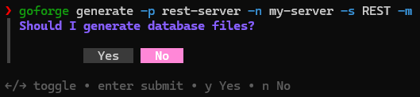
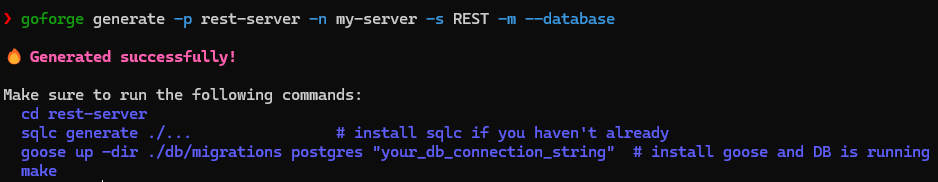
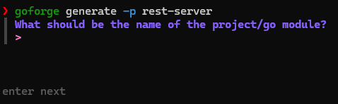

# goforge

Opinionated CLI/TUI tool for generating Go backend service boilerplate

### Overview

Inspired by the fact that I hate rewriting and copy pasting code that I have already written before, so I decided to create a CLI tool to generate the needed files and folder structure to quickly create a new backend service.

The idea is that these are backend services (like microservices), not an entire backend monolith implementation. For starters though this generates a good strtucture, but for it to be an entire monolith it would need to require extra setup from yourself.

P.S. This was encountered while working on [fáfnir](https://github.com/andrearcaina/fafnir).

### Installation
`goforge` can be installed on Windows or Linux, WSL, Git Bash:

Install via cURL on Linux, WSL, or Git Bash:
```bash
curl -fsSL https://raw.githubusercontent.com/andrearcaina/goforge/main/install.sh | sh
```

Install via Powershell on Windows:
```bash
irm https://raw.githubusercontent.com/andrearcaina/goforge/main/install.ps1 | iex
```

Or via Go (requires Go 1.24.5 or later):
```bash
go install github.com/andrearcaina/goforge@latest
```

### CLI Usage

This CLI can generate three server types, along with optional database scaffolding. For now, it only generates a REST API. See the [TODO](#todo) section for planned features.

To generate a Go REST server, run:
```
> goforge generate -p rest-server -n my-server -s REST -m
```
This command does the following:
- Creates a directory named `rest-server`
- Initializes a `go.mod` file with the module name `my-server`
- Configures the server type as `REST`
- Generates a `Makefile`

### Interactive Mode (TUI)

If any required flags are missing, an interactive TUI will appear:


You can see that the TUI appears, asking if you should generate the database files.

The following fields must be provided either via CLI flags or through the TUI (check [`internal/spec/config.go`](internal/spec/config.go)):

```go
type ServerTypeFlag string

const (
	REST    ServerTypeFlag = "rest"
	GRPC    ServerTypeFlag = "grpc"
	GraphQL ServerTypeFlag = "graphql"
)

type Form struct {
	Name           string
	ServerTypeFlag ServerTypeFlag
	DatabaseFlag   bool
	MakefileFlag   bool
}
```
If all required flags are provided (including `--database`), the TUI is skipped and the server is generated immediately.

For example, running with all required flags will produce:


Here is an example where you can trigger the TUI:


### TODO

In no particular order:

- [ ] Allow different server type boilerplates 
    - [x] REST (`go-chi`)
    - [ ] gRPC (`grpc-go`)
    - [ ] GraphQL (`gqlgen`)
- [X] Add Makefile support flag
- [x] Add SQLc/database support flag
    - [X] Potentially add a docker-compose file to spin up a PostgreSQL instance
- [x] Interactive UI for when certain flags are not provided
- [X] Add installation scripts for both Windows and Linux
